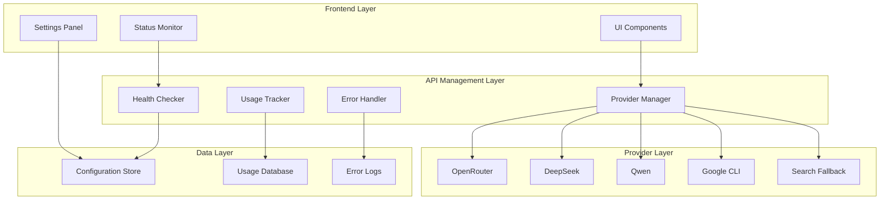

# Design Document

## Overview

The Enhanced API Management and Fallback System will provide a robust, user-friendly interface for managing multiple AI providers with intelligent fallback mechanisms, real-time monitoring, and comprehensive error handling. The system will address the current API connectivity issues while providing users with better visibility and control over their AI code generation experience.

## Architecture

### System Architecture



### Component Architecture

The system will be built using a modular architecture with clear separation of concerns:

1. **API Management Service** - Centralized provider management
2. **Health Monitoring Service** - Real-time status checking
3. **Usage Analytics Service** - Cost and usage tracking
4. **Error Handling Service** - Comprehensive error management
5. **Configuration Service** - Dynamic provider configuration

## Components and Interfaces

### 1. API Provider Manager

**Purpose:** Centralized management of all AI providers with intelligent routing and fallback logic.

**Key Features:**
- Provider registration and configuration
- Automatic health checking
- Intelligent provider selection based on success rates
- Seamless fallback chain management

**Interface:**
```typescript
interface ProviderManager {
  registerProvider(provider: ProviderConfig): Promise<void>
  getProviderStatus(providerId: string): Promise<ProviderStatus>
  selectBestProvider(): Promise<ProviderConfig>
  executeWithFallback(prompt: string): Promise<GenerationResult>
  updateProviderConfig(providerId: string, config: Partial<ProviderConfig>): Promise<void>
}
```

### 2. Health Monitoring Service

**Purpose:** Real-time monitoring of provider health and availability.

**Key Features:**
- Periodic health checks (every 5 minutes)
- Authentication validation
- Model availability checking
- Network connectivity testing

**Interface:**
```typescript
interface HealthMonitor {
  checkProviderHealth(providerId: string): Promise<HealthStatus>
  validateApiKey(providerId: string, apiKey: string): Promise<ValidationResult>
  getProviderMetrics(providerId: string): Promise<ProviderMetrics>
  subscribeToHealthUpdates(callback: HealthUpdateCallback): void
}
```

### 3. Usage Analytics Service

**Purpose:** Track API usage, costs, and provide optimization recommendations.

**Key Features:**
- Per-provider usage tracking
- Cost estimation and comparison
- Usage limit monitoring
- Optimization suggestions

**Interface:**
```typescript
interface UsageAnalytics {
  trackApiCall(providerId: string, tokens: number, cost: number): Promise<void>
  getUsageSummary(timeframe: TimeFrame): Promise<UsageSummary>
  getCostComparison(): Promise<CostComparison>
  checkUsageLimits(providerId: string): Promise<LimitStatus>
}
```

### 4. Error Handling Service

**Purpose:** Comprehensive error management with actionable recovery suggestions.

**Key Features:**
- Detailed error categorization
- Provider-specific troubleshooting
- Automatic retry logic
- User-friendly error messages

**Interface:**
```typescript
interface ErrorHandler {
  categorizeError(error: ApiError): ErrorCategory
  getTroubleshootingSteps(error: ApiError): TroubleshootingStep[]
  shouldRetry(error: ApiError): boolean
  getRetryDelay(error: ApiError): number
  formatErrorMessage(error: ApiError): string
}
```

## Data Models

### Provider Configuration

```typescript
interface ProviderConfig {
  id: string
  name: string
  baseUrl: string
  apiKey: string
  models: string[]
  rateLimits: RateLimits
  pricing: PricingInfo
  enabled: boolean
  priority: number
  retryCount: number
  timeout: number
}

interface ProviderStatus {
  id: string
  status: 'available' | 'unavailable' | 'error' | 'checking'
  lastCheck: Date
  errorMessage?: string
  responseTime: number
  successRate: number
  availableModels: string[]
}
```

### Usage Tracking

```typescript
interface UsageRecord {
  providerId: string
  timestamp: Date
  tokensUsed: number
  cost: number
  success: boolean
  errorType?: string
  model: string
}

interface UsageSummary {
  totalCalls: number
  totalCost: number
  successRate: number
  averageResponseTime: number
  providerBreakdown: ProviderUsage[]
}
```

### Error Management

```typescript
interface ApiError {
  providerId: string
  errorCode: string
  message: string
  statusCode: number
  timestamp: Date
  context: ErrorContext
}

interface ErrorContext {
  model: string
  promptLength: number
  retryCount: number
  userAgent: string
}
```

## Error Handling

### Error Categories

1. **Authentication Errors** (401, 403)
   - Invalid API key
   - Expired API key
   - Insufficient permissions

2. **Rate Limiting Errors** (429)
   - Rate limit exceeded
   - Quota exceeded
   - Account suspended

3. **Model Errors** (400, 404)
   - Model not found
   - Model unavailable
   - Invalid model parameters

4. **Network Errors**
   - Connection timeout
   - DNS resolution failure
   - SSL/TLS errors

5. **Service Errors** (500, 502, 503)
   - Provider service unavailable
   - Internal server error
   - Gateway timeout

### Error Recovery Strategies

1. **Immediate Retry** - For transient network errors
2. **Provider Switch** - For authentication or model errors
3. **Fallback to Search** - When all AI providers fail
4. **User Notification** - For persistent errors requiring user action

## Testing Strategy

### Unit Testing

1. **Provider Manager Tests**
   - Provider registration and configuration
   - Health check functionality
   - Provider selection logic
   - Fallback chain execution

2. **Health Monitor Tests**
   - API key validation
   - Model availability checking
   - Network connectivity testing
   - Status update propagation

3. **Usage Analytics Tests**
   - Usage tracking accuracy
   - Cost calculation
   - Limit monitoring
   - Data aggregation

4. **Error Handler Tests**
   - Error categorization
   - Retry logic
   - Message formatting
   - Recovery suggestions

### Integration Testing

1. **End-to-End Provider Testing**
   - Complete provider lifecycle
   - Configuration updates
   - Status monitoring
   - Error handling

2. **Fallback Chain Testing**
   - Multiple provider failures
   - Search fallback activation
   - User notification flow

3. **Performance Testing**
   - Health check performance
   - Provider selection speed
   - Error handling latency

### User Acceptance Testing

1. **Configuration Management**
   - API key entry and validation
   - Provider enable/disable
   - Settings persistence

2. **Status Monitoring**
   - Real-time status updates
   - Error message clarity
   - Recovery action effectiveness

3. **Usage Analytics**
   - Usage data accuracy
   - Cost tracking precision
   - Optimization suggestions

## Implementation Considerations

### Security

1. **API Key Management**
   - Secure storage using environment variables
   - Encryption for sensitive data
   - Access control for configuration changes

2. **Error Information**
   - Sanitize error messages to prevent information leakage
   - Log errors securely without exposing sensitive data
   - Implement proper error boundaries

### Performance

1. **Health Checking**
   - Implement caching to reduce API calls
   - Use background workers for health checks
   - Optimize check frequency based on provider reliability

2. **Usage Tracking**
   - Batch usage data updates
   - Implement efficient data storage
   - Use background processing for analytics

### Scalability

1. **Provider Management**
   - Design for easy addition of new providers
   - Implement plugin architecture for provider integration
   - Support dynamic provider configuration

2. **Error Handling**
   - Implement circuit breaker pattern for failing providers
   - Use exponential backoff for retries
   - Support custom error handling per provider

### User Experience

1. **Status Visibility**
   - Clear visual indicators for provider status
   - Real-time updates without page refresh
   - Intuitive error messages with actionable steps

2. **Configuration Management**
   - Simple API key entry with validation
   - One-click provider testing
   - Easy provider switching and prioritization

## Migration Strategy

### Phase 1: Core Infrastructure
- Implement provider manager and health monitoring
- Add enhanced error handling
- Create usage tracking system

### Phase 2: UI Enhancements
- Update settings panel with provider management
- Add real-time status indicators
- Implement usage analytics dashboard

### Phase 3: Advanced Features
- Add intelligent provider selection
- Implement cost optimization
- Create advanced error recovery

### Phase 4: Optimization
- Performance tuning
- User experience improvements
- Advanced analytics and insights 